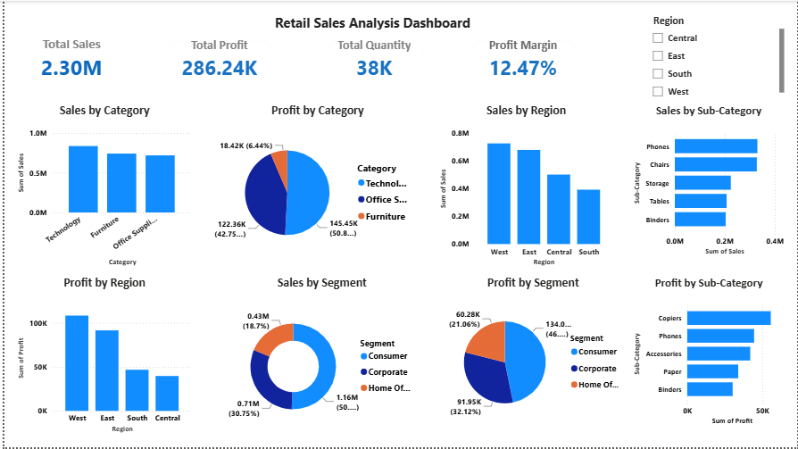

# Retail Sales Analysis Dashboard

## Project Overview

This project analyzes retail sales data to understand sales performance, profitability, product categories, regions and customer segments.

The project uses Excel, MySQL and Power BI to complete the data analysis workflow from data preparation to interactive dashboard creation.

## Tools & Technologies

- Excel
- MySQL
- Power BI

## Project Workflow

Excel → Data Cleaning & Validation  
MySQL → Data Storage & SQL Analysis  
Power BI → Data Visualization & Interactive Dashboard

## Key Analysis

- Sales by Category
- Profit by Category
- Sales by Region
- Profit by Region
- Sales by Segment
- Profit by Segment
- Sales by Sub-Category
- Profit by Sub-Category

## Dashboard KPIs

- Total Sales
- Total Profit
- Total Quantity
- Profit Margin

## Power BI Features

- Interactive KPI Cards
- Bar Charts
- Donut Charts
- Region Slicer
- Interactive Filtering
- Business Performance Analysis

## Key Insights

- Technology contributes significantly to overall sales and profit.
- West and East are among the stronger-performing regions.
- Consumer segment contributes the highest sales and profit.
- Product sub-category performance varies significantly across sales and profit.

 </> Markdown
- ## Dashboard Preview
- ## Future Scope

- Sales forecasting
- Customer-level analysis
- Product performance analysis
- Automated data refresh
- Predictive analysis using Python and Machine Learning

